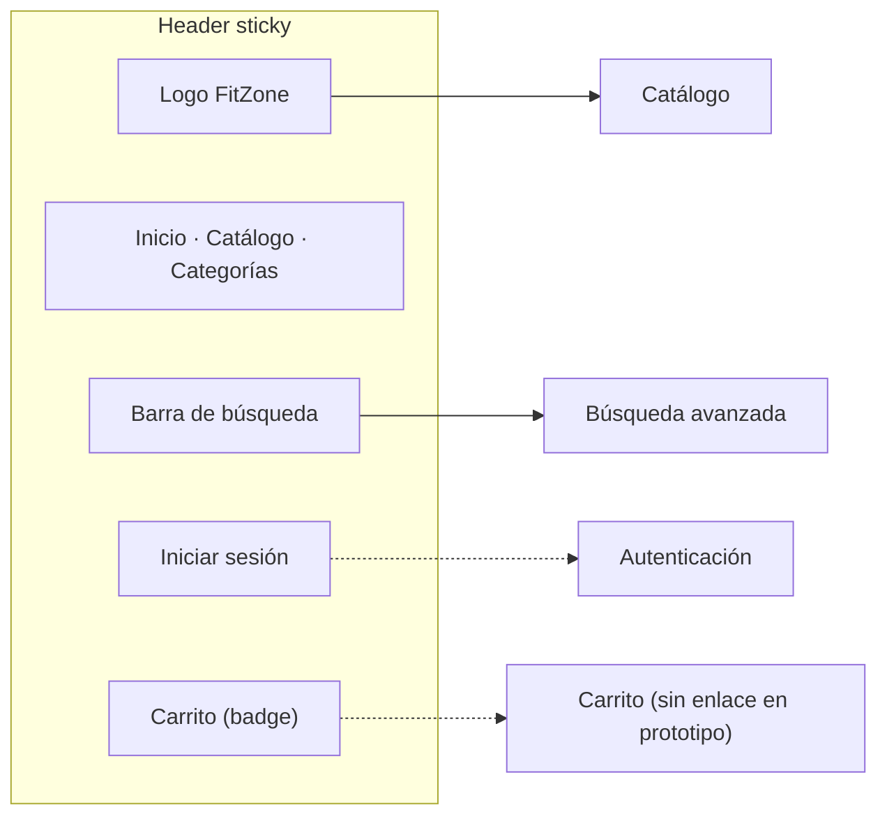
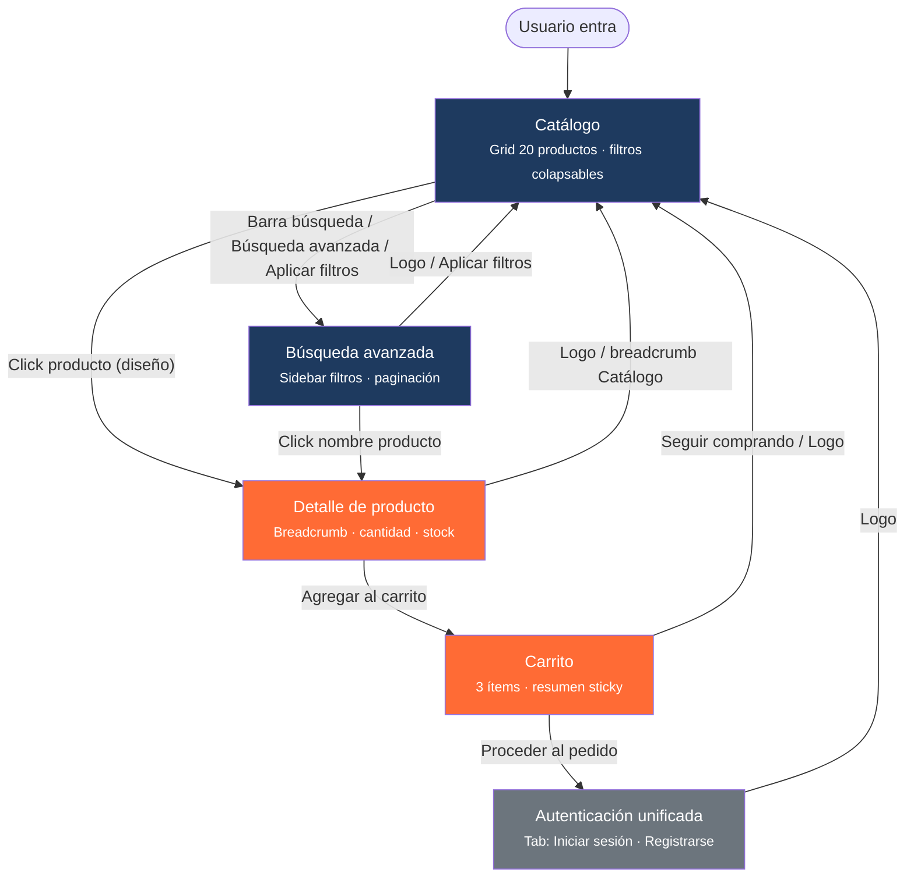
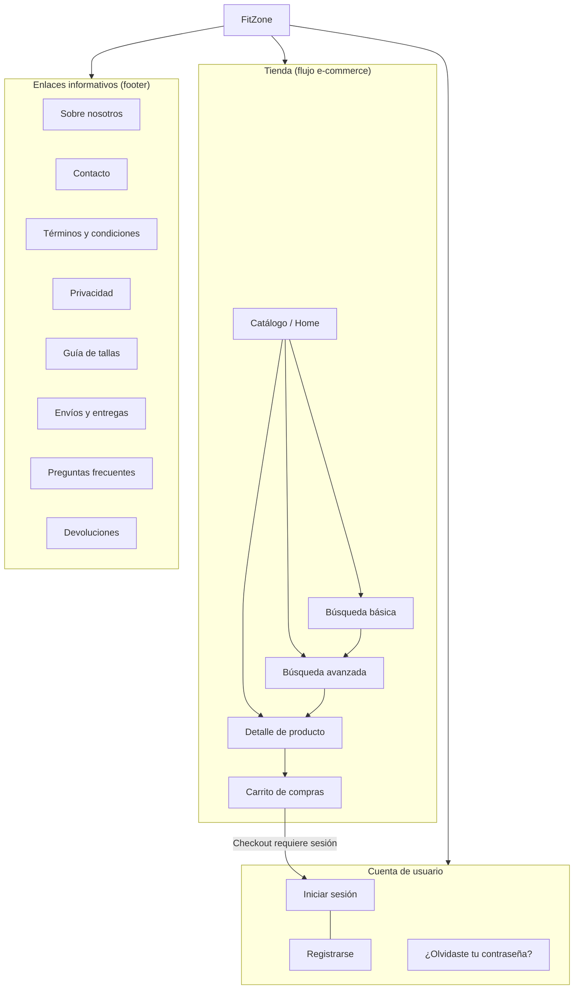

# FitZone — Estructura de navegación

Diagrama basado en el prototipo interactivo de Stitch (`docs/stitch-exports/prototype/`) y el flujo documentado en `manifest.json`.

## Mapa de pantallas

| Pantalla | Archivo prototipo | Rol |
|----------|-------------------|-----|
| **Catálogo** (home) | `catalogo-interactivo.html` | Punto de entrada principal |
| **Búsqueda avanzada** | `busqueda-interactiva.html` | Resultados con filtros |
| **Detalle de producto** | `detalle-interactivo.html` | Ficha del artículo |
| **Carrito** | `carrito-interactivo.html` | Resumen de compra |
| **Autenticación** | `auth-interactiva.html` | Login / Registro (tabs) |

---

## 1. Navegación global (header — presente en todas las pantallas)

> **Nota:** En el prototipo Stitch, `Inicio`, `Catálogo` y `Categorías` del menú principal no tienen enlaces activos (excepto el logo, que vuelve al catálogo). El icono de carrito tampoco navega desde el header; el acceso al carrito es por el flujo de compra.

---

## 2. Flujo principal entre pantallas

---

## 3. Estructura del sitio (árbol de secciones)

---

## 4. Resumen de transiciones (prototipo)

| Origen | Acción | Destino |
|--------|--------|---------|
| Catálogo | Barra de búsqueda (header) | Búsqueda avanzada |
| Catálogo | Enlace «Búsqueda avanzada» | Búsqueda avanzada |
| Catálogo | Botón «Aplicar» (filtros) | Búsqueda avanzada |
| Catálogo | Click en producto | Detalle *(definido en diseño)* |
| Búsqueda | Click en nombre de producto | Detalle |
| Búsqueda | Logo / «Aplicar filtros» | Catálogo |
| Detalle | «Agregar al carrito» | Carrito |
| Detalle | Logo / breadcrumb «Catálogo» | Catálogo |
| Carrito | «Seguir comprando» / Logo | Catálogo |
| Carrito | «Proceder al pedido» | Auth (tab Iniciar sesión) |
| Auth | Logo | Catálogo |

---

## 5. Pantallas fuera del flujo activo

Según `docs/stitch-exports/PANTALLAS-A-ELIMINAR.md`, las versiones legacy de Login y Registro como pantallas separadas fueron reemplazadas por la **Autenticación unificada con tabs**.
